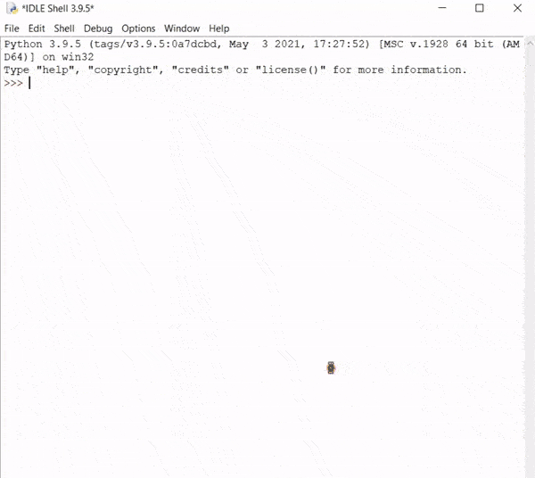

# Results

Mask:

Region of Interest (ROI):

Final Footage (successfully tracked Heavy vehicles only):

Tracked Co-ordinates (using tracker object):

# Problem statement

Use OpenCV Object tracking to make Trafficc Management System. 

Track only Heavy vehicles (like car, bus, truck, etc.) from Traffic with all types of vehicles (including bikes, bicycle, people, etc.). 

Return the tracked co-ordinates for each object separately.

#

Some other useful applications of Code can be in Keeping tracks of objects on conveyor belt, Counting people in certain area, other traffic scenarios, etc.
